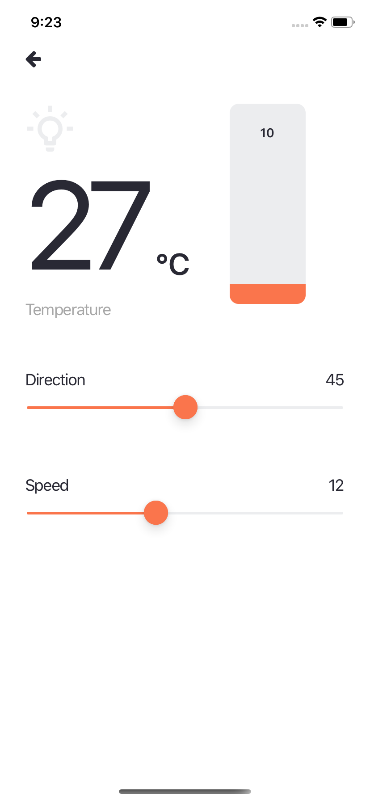

<h4 align="center">
    
</h4>

<h1 align="center">
    SmartHome App
</h1>

## :bookmark: Sobre

Desenvolvimento de uma interface de um App para controle de equipamentos de IoT

## :rocket: Tecnologias Utilizadas

O projeto foi desenvolvido utilizando as seguintes tecnologias

- [React Native](https://reactnative.dev/)
  - [React Native Communications](react-native-communications)
- [Expo](https://expo.io/)

## :iphone: Telas

<h4 align="center">
    
    

</h4>

---

<h4 align="center">
    Feito com 💜 by Deusdete Filho</a>
</h4>
